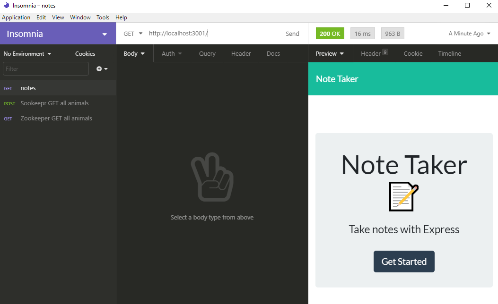
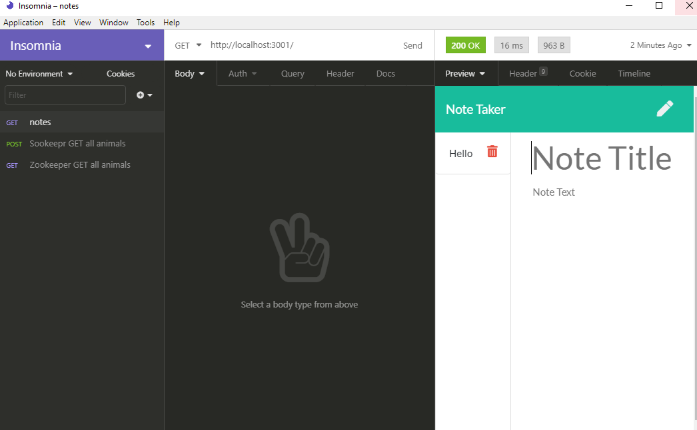
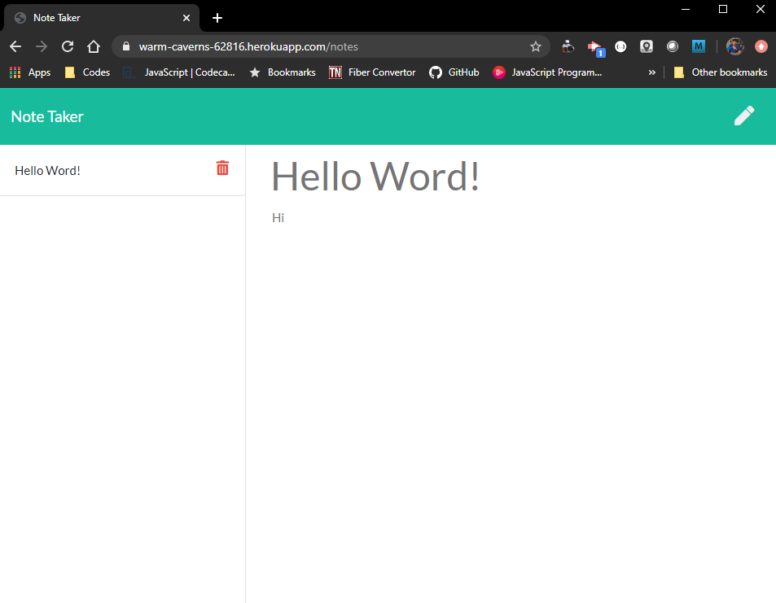

# Note-Taker

   

## Description

This assignment was created with the components of Express.js.

Combined various NPMs such as inquirer, fs, express and the use of classes and Constructor functions.

  ## Table of Contents

  - [Installation](#installation)
  - [Testing](#tests)
  - [Usage](#usage)
  - [License](#license)
  - [Contributors](#contributors)
  - [Link to Deployed Application](#link)

  ## Installation

  - Run Command: npm init -y
  - Run Command: npm i express
  - Run Command: npm fs 
  - Run Command: npm require
  - Run Command: npm uuid

  ## Tests

  - Run Command: npm run test
  

  - Run node index.js

  

  - Node index.js browser results

  

  ## Usage

  - Must install npm as the application will collect the data usign command line with node.js. 

  ## License

    MIT License

  Copyright (c) 2020 Edgar Torres

  Permission is hereby granted, free of charge, to any person obtaining a copy
  of this software and associated documentation files (the "Software"), to deal
  in the Software without restriction, including without limitation the rights
  to use, copy, modify, merge, publish, distribute, sublicense, and/or sell
  copies of the Software, and to permit persons to whom the Software is
  furnished to do so, subject to the following conditions:

  The above copyright notice and this permission notice shall be included in all
  copies or substantial portions of the Software.

  THE SOFTWARE IS PROVIDED "AS IS", WITHOUT WARRANTY OF ANY KIND, EXPRESS OR
  IMPLIED, INCLUDING BUT NOT LIMITED TO THE WARRANTIES OF MERCHANTABILITY,
  FITNESS FOR A PARTICULAR PURPOSE AND NONINFRINGEMENT. IN NO EVENT SHALL THE
  AUTHORS OR COPYRIGHT HOLDERS BE LIABLE FOR ANY CLAIM, DAMAGES OR OTHER
  LIABILITY, WHETHER IN AN ACTION OF CONTRACT, TORT OR OTHERWISE, ARISING FROM,
  OUT OF OR IN CONNECTION WITH THE SOFTWARE OR THE USE OR OTHER DEALINGS IN THE
  SOFTWARE.

  ## Contributors

  - [GitHub Profile](https://github.com/Torreseam)

  ## Link

  - [GitHub Repo](https://github.com/torreseam/Note-Taker.git)

  ## HEROKU

  - [Heroku Link](https://warm-caverns-62816.herokuapp.com/)